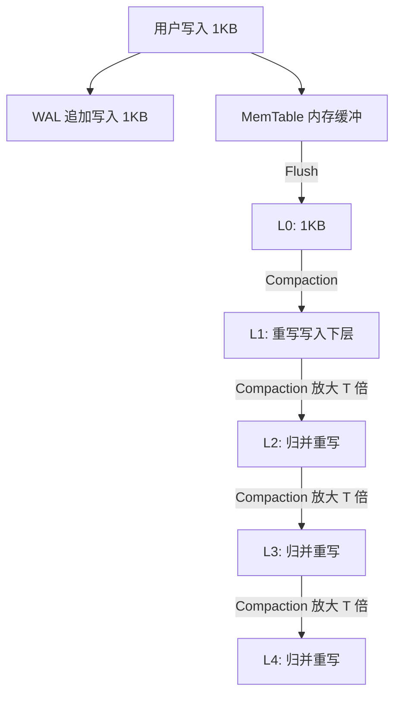
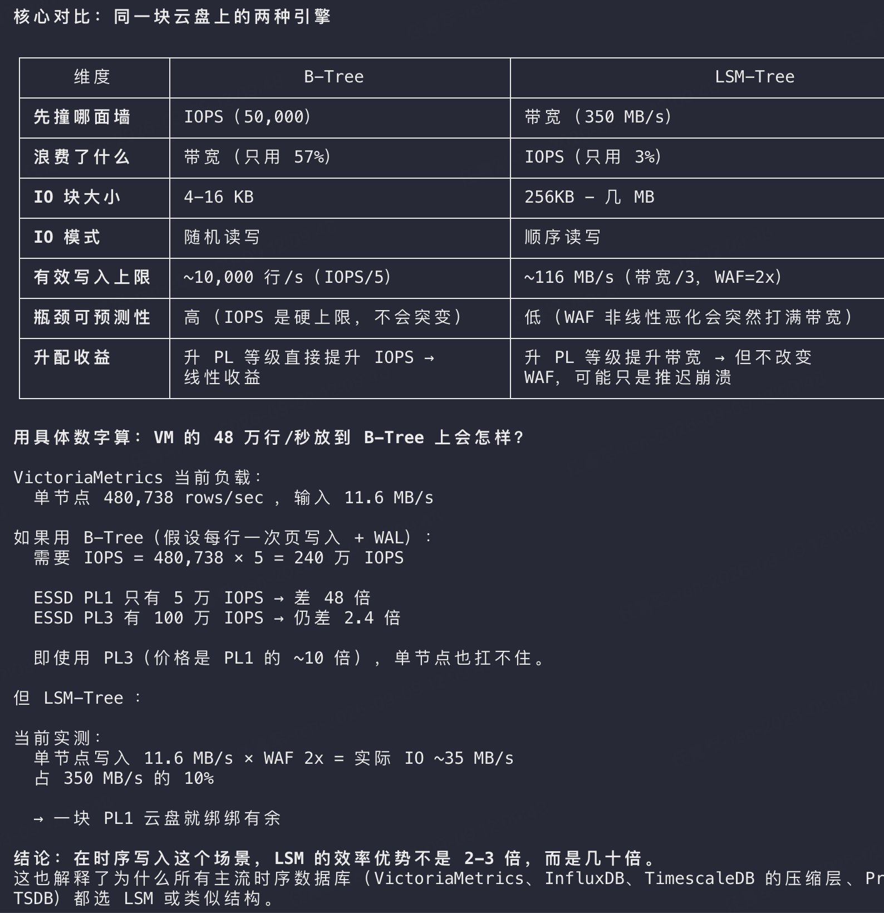
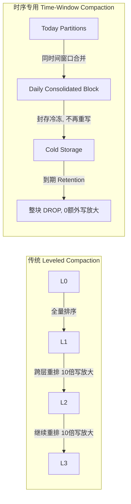

# LSM-Tree vs B-Tree 在云盘时代的重构：为什么生产实测 WAF 只有 1.9x？

> **核心摘要**：  
> 经典神书《DDIA》（数据密集型应用系统设计）指出 LSM-Tree 的写放大（WAF）理论值高达 10x ~ 30x，常令人误以为 LSM 是为了极致顺序写而承受巨大代价的“妥协产物”。  
> 然而，在现代大内存与云盘（如 AWS EBS / 阿里云 ESSD）生产环境下，VictoriaMetrics 面对 **单节点 48 万行/秒** 的高吞吐写入，**45 天实测写放大仅有 1.9x**。  
> 本文结合云计算专家包研（@plantegg）的实战案例与真实压测数据，深度剖析硬件演进、云盘经济学与三大工程因子如何将理论写放大斩落一个数量级，并探讨时序存储引擎的底层进化逻辑。

---

## 目录 (Table of Contents)

1. [背景与反直觉命题：DDIA 的“真空球形奶牛”](#1-背景与反直觉命题ddia-的真空球形奶牛)
2. [理论模型解密：为什么书上说 LSM-Tree 写放大是 10~30x？](#2-理论模型解密为什么书上说-lsm-tree-写放大是-1030x)
3. [三大工程利器：真实生产如何把写放大砍到 1.9x？](#3-三大工程利器真实生产如何把写放大砍到-19x)
4. [云盘经济学：从“IOPS 瓶颈”到“带宽 (BPS) 瓶颈”的大转移](#4-云盘经济学从iops-瓶颈到带宽-bps-瓶颈的大转移)
5. [硬核数字推演：单节点 48 万行/秒在两种引擎下的算力账单](#5-硬核数字推演单节点-48-万行秒在两种引擎下的算力账单)
6. [深度拓展与延伸：时序 Compaction 与 RUM 猜想](#6-深度拓展与延伸时序-compaction-与-rum-猜想)
7. [方法论总结：系统性能工程的学习范式](#7-方法论总结系统性能工程的学习范式)

---

## 1. 背景与反直觉命题：DDIA 的“真空球形奶牛”

Martin Kleppmann 的《Designing Data-Intensive Applications》（DDIA）被誉为分布式与存储系统的必读圣经。在第 3 章“存储与检索”中，作者对比了两种主流的底层存储引擎范式：

- **B-Tree（及其变体 B+Tree）**：更新通常就地修改磁盘 Page，写入时带来随机 IO，但结构确定、读取预测性好；
- **LSM-Tree（Log-Structured Merge-Tree）**：所有写入均以追加写日志（Append-only WAL）和内存排序表（MemTable）完成，后续通过后台多路归并排序（Compaction）维护有序 SSTable。

书中明确提到：**LSM-Tree 的写放大（Write Amplification Factor, WAF）理论值通常在 10x ~ 30x，而 B-Tree 更加“可预测”。**

许多初学者（乃至有多年经验的架构师）读完后往往形成一个刻板印象：
> “LSM-Tree 是一个不得已的妥协——为了保住高并发写入吞吐，系统在暗中承受着数倍乃至数十倍的写放大成本，是对磁盘寿命和系统带宽的透支。”

然而，云计算与性能工程专家包研（@plantegg）在 2026 年针对 VictoriaMetrics（基于 LSM 思想的时序数据库引擎）的大规模生产集群复盘中给出了截然相反的事实：

```
生产集群规模：12 节点
单节点写入负载：480,738 rows/s（约 48 万行/秒，输入流量 11.6 MB/s）
运行周期：连续实测 45 天
实际写放大 (WAF)：仅 1.9x ！
```

**不是 10x，不是 20x，而是令人惊叹的 1.9x。**

物理学里有一个著名的笑话：“假设有一头真空中的球形奶牛……”。书本上的理论推导往往建立在简化的孤立假设之上，而真实的工业级存储引擎由现代 Linux 内核、云盘 QoS 配额、内存拓扑与压缩算法层层包裹。正是这些工程实现，将纸面理论上的写放大生生削掉了近一个数量级。

---

## 2. 理论模型解密：为什么书上说 LSM-Tree 写放大是 10~30x？

要理解生产实测为何能做到 1.9x，首先必须搞清楚学术理论推导中的 10~30x 是怎么算出来的。

### 什么是写放大 (WAF)？

$$\text{WAF} = \frac{\text{实际写入存储介质的总字节数}}{\text{用户应用请求写入的有效数据字节数}}$$

在经典的 Leveled Compaction 架构（如标准 RocksDB/LevelDB）中：
1. 数据首先写入 WAL 和内存中的 MemTable；
2. MemTable 满后 Flush 到磁盘成为 Level 0（L0）的 SSTable；
3. 每一层的大小通常以固定倍数 $T$（通常 $T=10$）递增，例如 L1 是 10MB，L2 是 100MB，L3 是 1GB，L4 是 10GB；
4. 当某一层容量超标时，需要将一个文件与下一层中有重叠 Key 区间的所有文件读取出来，在内存中做多路归并排序，然后再全部写回下一层。



在严格的按层归并模型下，一个数据块从 L0 逐级合并到最大层，理论上在每一层 Compaction 都会伴随着约 10 倍的数据重写：
$$\text{理论 } \text{WAF} \approx 1 (\text{WAL}) + 1 (\text{Flush to L0}) + T \times (\text{总层数} - 1)$$
这就是经典理论推导出 **10x ~ 30x 写放大** 的根源。

---

## 3. 三大工程利器：真实生产如何把写放大砍到 1.9x？

为什么在 VictoriaMetrics 等现代生产系统的实测中，写放大能奇迹般地压低至 1.9x？核心在于三大被理论模型忽略的工程要素：

### 利器 1：极高压缩比（zstd 6:1）抵消绝对落盘量

时序数据（Metrics/Timeseries）具有高度的局部规律性：
- 时间戳以固定的步长单调递增（通过 Double-Delta 算法可以压缩到几乎只需几个 bit）；
- 指标名称（Metric Name）与标签集合（Tags/Labels）高度重复（通过全局索引词表字典化）；
- 数值类型浮点数变化平缓（通过 Gorilla XOR 浮点压缩）。

VictoriaMetrics 在块落盘前施加了极高效率的 **zstd** 压缩算法，达到了 **6:1 的综合压缩比**。

**压缩对写放大的对冲效应**：
假设用户输入了 100MB 原始数据，经过内存预聚合与压缩后，落盘实际只有 16.6MB。即使后续在局部层次做了一轮合并写回，重写量也是建立在极小的“压缩后体积”之上。压缩直接把存储计算的分母和分子进行了重塑。

### 利器 2：现代超大内存与 Page Cache 的高截流率

在 2015 年设计存储架构时，主流服务器内存普遍在 16GB ~ 32GB。而在现代云原生环境下，主机普遍配置 **128GB ~ 512GB** 物理内存。

- **内存中多路抵消**：极短生命周期的数据、同一时间序列的多次频繁更新，在尚未 Flush 或处于极浅层（L0/L1）时，就被下一轮合并消化；
- **Page Cache 拦截合并读**：后台 Compaction 执行归并读取时，由于操作系统 Page Cache 极大，读取的数据绝大多数直接命中内存 Cache，几乎**不需要真正向物理磁盘发起读请求**，更避免了因为读慢而引起的写入反压。

### 利器 3：数据保留期（Retention）驱动的“低层自然消亡”

DDIA 的理论模型假设数据是**永久保留（Append & Retain Forever）**的，因此所有冷数据最终都会无可避免地跌落到最高层（Level 4 / Level 5），承受每一层归并的写放大惩罚。

但在实际生产中：
- 监控时序数据普遍配置了 **Retention 策略**（例如保留 15 天、30 天或 45 天）；
- 存储引擎通常按时间范围（Time Partitions）切分目录存储。随着时间推进，老的数据分区在还没来得及经历第 3、4 层的深层归并之前，就已经伴随着整个时间分区的到期而**被整块 `rm -rf` 丢弃（DROP Partition）**！
- 绝大多数数据在 L1/L2 浅层就结束了自己的生命周期，**最昂贵、最具破坏力的深层 Compaction 从未发生**。

---

## 4. 云盘经济学：从“IOPS 瓶颈”到“带宽 (BPS) 瓶颈”的大转移

硬件的介质变革彻底改写了存储性能的瓶颈公式。

### 历史三阶段演进

```
1. 机械硬盘时代 (HDD, ~2015 前)
   - 随机寻道延迟高达 10ms，随机 IOPS 仅 100~200
   - 顺序写入吞吐可达 100~150 MB/s
   - 【核心准则】：绝对禁止随机 IO！顺序写（LSM WAL）是唯一生路。

2. 本地 NVMe SSD 时代 (~2018)
   - 闪存芯片原生支持高并发微秒级随机读写，IOPS 跃升至 50万~100万+
   - 【核心认识】：IOPS 不再是稀缺资源，随机读写性能极大改善。

3. 现代云原生网络云盘时代 (AWS EBS / 阿里云 ESSD, 2026)
   - 存储与计算分离，云盘本质是“网络分布式块存储服务”
   - 云厂商通过 QoS 算法限制虚拟机的网络配额
   - 【颠覆性现实】：IOPS 便宜充沛，但吞吐带宽 (BPS, MB/s) 极其昂贵！
```

### 同一块云盘上的两种引擎对比

包研在其复盘中给出了同一块标准云盘（以阿里云 ESSD PL1 1TB 为例）下两种存储引擎的表现：



| 核心对比维度 | B-Tree 引擎 | LSM-Tree 引擎 | 架构原理解析 |
| :--- | :--- | :--- | :--- |
| **先撞哪面墙** | **IOPS 墙** (如 50,000 IOPS) | **带宽墙** (如 350 MB/s) | B-Tree 频繁写入 4KB/16KB 脏页；LSM 批量刷入数百 KB 大块 |
| **浪费了什么资源** | **带宽**（实际只利用了 57%） | **IOPS**（实际只利用了 3%） | B-Tree 占满 IO 队列但未打满通道；LSM 压满网络带宽 |
| **单次 IO 块大小** | 4 KB ~ 16 KB | 256 KB ~ 几个 MB | 局部更新 vs 批量合并顺序刷盘 |
| **IO 访问模式** | **随机读写** | **顺序读写** | 树状就地覆写 vs 流式追加与多路归并 |
| **有效写入上限** | 约 10,000 行/秒 ($\approx \text{IOPS} / 5$) | 约 116 MB/s ($\approx \text{带宽} / 3, \text{WAF}=2x$) | 写入能力的天花板由其先撞上的墙决定 |
| **瓶颈可预测性** | **高**（IOPS 是硬上限，不会突变） | **低**（若非线性恶化，Compaction 突发打满带宽） | 传统 DBA 更偏爱 B-Tree 的平稳与可预期性 |
| **升配升级收益** | 提升云盘等级直接线性提高 IOPS | 提升云盘等级获得更高带宽，但不改变 WAF | B-Tree 升配能立即解渴；LSM 优化重点在算法与策略 |

---

## 5. 硬核数字推演：单节点 48 万行/秒在两种引擎下的算力账单

包研在推文中进行了严密的数学推演，将 VictoriaMetrics 的实际生产负载套入 B-Tree 架构进行压测测算：

### 生产真实负载
- 单节点摄入量：**480,738 rows/sec**（约 48 万行/秒）
- 原始输入网络流量：**11.6 MB/s**

---

### 场景 A：如果改用 B-Tree 存储引擎

假设每行写入导致一次索引/数据页更新，并计入 WAL（按每 5 行合并一次脏页刷盘的保守估计）：
$$\text{所需 IOPS} = 480,738 \times 5 = \mathbf{2,403,690} \text{ IOPS (约 240 万)}$$

对照云厂商提供的云盘规格：
- **ESSD PL1 云盘**：提供约 5 万 IOPS $\longrightarrow$ **相差 48 倍！**
- **ESSD PL3 顶级云盘**：提供约 100 万 IOPS $\longrightarrow$ **仍然存在 2.4 倍的缺口！**
- **经济账**：ESSD PL3 的单价是 PL1 的 **10 倍以上**。即使企业愿意支付 10 倍存储费用租用最顶级的 PL3，**单节点依然瞬间被打爆**，无法支撑该业务流量。

---

### 场景 B：采用 LSM-Tree 存储引擎（VictoriaMetrics 实测）

- 单节点原始写入：11.6 MB/s；
- 加上实测写放大系数 $\text{WAF} = 2.0x$（实际实测为 1.9x）：
$$\text{实际落盘 IO 吞吐} = 11.6 \text{ MB/s} \times 2.0 \approx \mathbf{35 \text{ MB/s}}$$

对照云厂商提供的云盘规格：
- 一块最普通的标准 **ESSD PL1 云盘** 自带 350 MB/s 吞吐带宽；
- 35 MB/s 的落盘流量仅占 350 MB/s 上限的 **10%**！
- **结果**：一块廉价的 PL1 云盘就游刃有余、轻轻松松承载了 48 万行/秒的洪峰写入。

> 📌 **核心结论**：  
> 在时序与高并发日志追加这类写入密集的典型场景中，**LSM-Tree 对比 B-Tree 的效能优势不是 2~3 倍，而是高达几十倍！**  
> 这也彻底解释了为什么当前业界所有的主流时序数据库（VictoriaMetrics、InfluxDB、Prometheus TSDB、TimescaleDB 的压缩块层），无一例外全都选择了 LSM-Tree 或其变体结构。

---

## 6. 深度拓展与延伸：时序 Compaction 与 RUM 猜想

为了将这篇博文的洞察升华到通用的数据库架构理论，我们需要进一步探讨两个高级内核课题：

### 1. 时序数据库为什么抛弃了 Leveled Compaction？

经典 LSM-Tree（如 LevelDB / RocksDB）普遍默认使用 **Leveled Compaction Strategy (LCS)**，因为它是为通用键值查询（Point Lookup）优化的。为了保证极高的读取效率，LCS 强制要求每一层的 Key 范围绝对互斥不重叠，这正是产生巨额写放大的元凶。

现代时序引擎普遍采用专为时间设计的 Compaction 策略：
- **Time-Window Compaction Strategy (TWCS)** / **按时间窗口归并**：
  - 仅允许落在相同时间窗口（如同一小时、同一天）的 SSTable 进行合并；
  - 绝不跨时间窗口跨层重写历史数据；
  - 当数据到达 Retention 期限时，整窗口直接 drop，彻底将历史数据的 WAF 压降至 0。
- **VictoriaMetrics 的 Part-Merge 机制**：
  - 不维护传统严格多级树，而是不断在后台将小的数据 Part 拼接成大 Part；
  - 大 Part 达到某个大小阈值后便停止合并，静止封存，极大减少不必要的二次归并。



### 2. 存储系统的 RUM 猜想（RUM Conjecture）

哈佛大学 DASlab 团队提出了著名的存储系统设计黄金法则——**RUM 猜想**：
> 在任何存储系统的设计中，**读取开销（Read Overhead, R）**、**更新开销（Update Overhead, U）** 与 **空间/内存开销（Memory/Space Overhead, M）** 构成一个不可兼得的“不可能三角”。优化其中两项，必然以牺牲第三项为代价。

```
                       Read (R)
                         /\
                        /  \
                       /    \
                      /      \
      B-Tree / B+Tree/        \  Fractal Tree
                    /          \
                   /            \
                  /______________\
        Update (U)               Memory/Space (M)
        LSM-Tree                 In-Memory Hash
```

- **B-Tree 倾向于优化 R 与 M**：点查极其迅速（只需 $O(\log_B N)$ 次寻址），空间碎片受控，但代价是极高的更新写入开销（Update Overhead 巨大，饱受随机写与页分裂之苦）；
- **LSM-Tree 倾向于优化 U 与 M**：通过连续追加与异步合并，将更新开销降至极限，并通过紧凑编码实现极致压缩，但代价是承受了一定的读放大（Read Overhead，需要布隆过滤器与多层扫描）；
- **云原生时序数据库的绝妙平衡**：时序业务是典型的“99% 追加写、1% 范围读（Range Query）、按时间批量失效”。VictoriaMetrics 精准利用业务不对称性，将 RUM 空间内的折衷发挥到了极致。

---

## 7. 方法论总结：系统性能工程的学习范式

从包研对《DDIA》的这篇精彩反思中，我们可以沉淀出三条通往优秀系统工程师的认知进阶范式：

1. **破除对权威教条的单向迷信**：
   DDIA 是不可多得的理论名著，但书中所述的理论往往基于理想化的抽象假设。如果只记住了“LSM 写放大 10~30x”，就会在架构选型时做出脱离实际的误判。
2. **永远带着硬件与云基础设施的真实账单思考**：
   现代架构师不能只看算法复杂度 $O(1)$ 或 $O(\log N)$，更要看底层存储介质的定价模型。在云盘时代，“先撞 IOPS 墙还是先撞带宽墙”决定了系统成本是 1000 元/月还是 10000 元/月。
3. **深入业务特征寻找工程杠杆**：
   VictoriaMetrics 之所以能把写放大砍到 1.9x，不是靠重写了底层数学，而是巧妙利用了**时序数据的高压缩比、局部生命周期与大内存缓存**。离开具体的业务数据形态去谈架构选型，无异于缘木求鱼。
