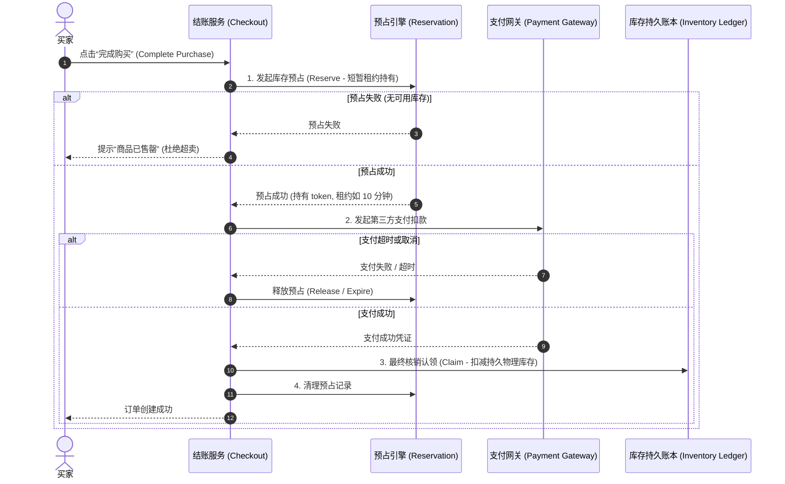
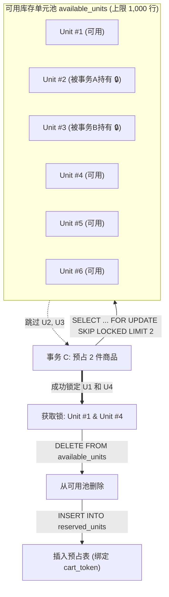
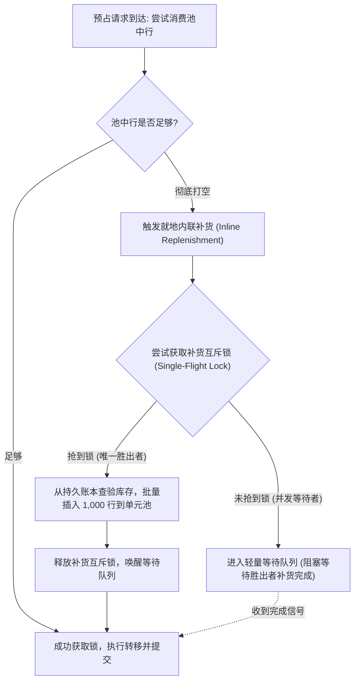
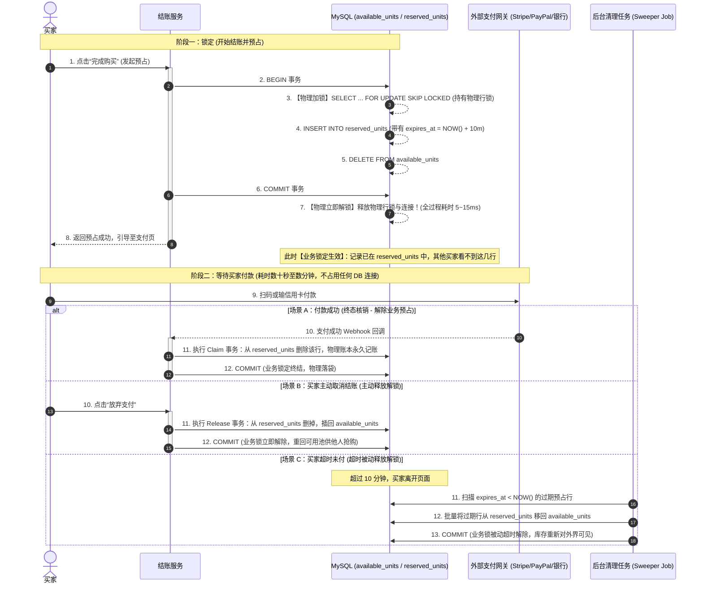
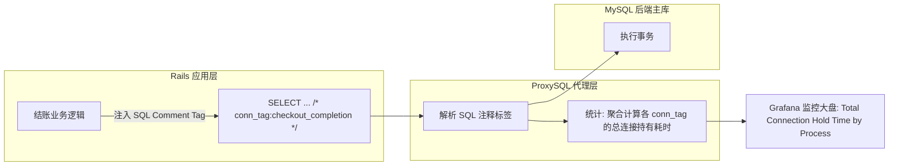

# 深度解构 Shopify 极限并发库存预占：MySQL `SKIP LOCKED` 架构演进与全场景案例剖析

> **核心摘要**：  
> 在电商极高并发的秒杀结账场景中，“防超卖（Oversell Protection）”一直是分布式系统设计的经典难题。长期以来，业界普遍奉行“Redis 内存扣减 + 异步同步数据库”或“分布式锁”的标准范式。  
> 然而，Shopify 在 2025 年黑色星期五（峰值每分钟 510 万美元销售额）的实战中，彻底推翻了这一惯性认知：通过将 Redis 替换为 MySQL 8，借助 `SELECT ... FOR UPDATE SKIP LOCKED`、有界单元行池（Bounded Unit-Row Pool）、复合主键以及 `READ COMMITTED` 隔离级别，不仅将库存预占（Reserve）与账本核销（Claim）统一收敛至单数据库原生的 ACID 事务中，根除了跨系统不一致性，而且在超高吞吐下实现了主库 CPU < 50%、从库 CPU < 16% 的卓越表现。  
> 本文不仅深度剖析 Shopify 该技术方案的底层数据库锁机制、连接池治理与架构演进，更从技术本质出发，系统推演该方案的**具体技术场景**、**4 大典型适用业务案例**、**4 大不适用反例推演**，以及业界 **5 种高并发库存扣减架构的全景横向对比**。

---

## 目录 (Table of Contents)

1. [业务本质与核心矛盾：防超卖（Oversell Protection）的分布式困局](#1-业务本质与核心矛盾防超卖oversell-protection的分布式困局)
2. [MySQL 方案的核心破局点：从“单行计数器”到“有界单元行池”](#2-mysql-方案的核心破局点从单行计数器到有界单元行池)
3. [四大 InnoDB 内核级工程关键决策深度剖析](#3-四大-innodb-内核级工程关键决策深度剖析)
4. [颠覆认知的运维瓶颈：连接持有时间治理而非 CPU](#4-颠覆认知的运维瓶颈连接持有时间治理而非-cpu)
5. [技术方案针对的具体技术场景定义](#5-技术方案针对的具体技术场景定义)
6. [适用场景深度案例分析 (Applicable Scenarios)](#6-适用场景深度案例分析-applicable-scenarios)
7. [不适用场景反例推演 (Non-applicable Scenarios)](#7-不适用场景反例推演-non-applicable-scenarios)
8. [五大高并发库存架构全景横向对比矩阵](#8-五大高并发库存架构全景横向对比矩阵)
9. [架构启示与工程方法论](#9-架构启示与工程方法论)

---

## 1. 业务本质与核心矛盾：防超卖（Oversell Protection）的分布式困局

### 1.1 业务生命周期：Reserve 与 Claim 的两阶段模型

在电商交易系统中，用户从加购到支付成功是一个典型的两阶段长链路过程：



这两项操作的容错边界极其苛刻：
- **超卖（Overselling）**：两笔并发结账锁定了同一件物理库存并最终成交，商家必须单方面取消订单、退款并承担客诉信誉与赔偿成本；
- **少卖（Underselling / 幽灵库存）**：明明有库存却由于锁残留或计数误差提示“售罄”，商家直接蒙受原本应得的销售额损失。

### 1.2 历史 Redis 架构的阿喀琉斯之踵

在 Shopify 历史版本中，预占系统基于 Redis 构建。每个商品 SKU 对应一个计数器 Key：
- 预占（Reserve）执行 `DECR`；
- 释放（Release）执行 `INCR`。

尽管 Redis 凭借单线程事件循环与纯内存模型能够轻松提供数万 QPS 的吞吐量，但将其置于真实金融交易级链路时，暴露出难以弥合的架构缺陷：

```text
┌─────────────────────────────────────────────────────────────┐
│                   双系统分布式状态断裂问题                   │
├─────────────────────────────────────────────────────────────┤
│                                                             │
│    [应用服务]                                               │
│       │                                                     │
│       ├── (1) Redis: DECR / INCR (瞬时预占状态)             │
│       │        ▲                                            │
│       │        │ 跨网络两阶段调用，无分布式事务保障         │
│       │        ▼                                            │
│       └── (2) MySQL: UPDATE ledger (物理持久账本)           │
│                                                             │
│   ❌ 故障场景 A: Payment 成功，MySQL Claim 成功，但清理     │
│                 Redis 失败/超时 -> 造成少卖（虚假售罄）     │
│   ❌ 故障场景 B: Payment 成功，Redis 预占过期，物理库存未扣  │
│                 减便被其他买家抢走 -> 造成超卖              │
│   ❌ 拓扑表达缺陷: Redis 难以以低成本表达跨仓库、多履约地   │
│                 点（Multi-location）的复合库存路由约束      │
│   ❌ 运维管理负担: 维护一套高可用 Redis Cluster 的成本与    │
│                 故障恢复复杂度极高                          │
└─────────────────────────────────────────────────────────────┘
```

Shopify 推进**统一数据库战略（Unified Database Strategy）**的根本动机，正是为了消除系统间的数据断裂——**如果能让预占（Reserve）和核销（Claim）在同一个 MySQL 实例内通过 ACID 事务原生完成，上述跨网络分布式一致性失效模式将在物理层面上直接消失。**

---

## 2. MySQL 方案的核心破局点：从“单行计数器”到“有界单元行池”

### 2.1 为什么传统单行计数器方案在高并发秒杀下必死？

许多开发团队在尝试将库存移入关系型数据库时，通常会写出如下代码：

```sql
-- 典型的单行原子扣减 (悲观锁 / 乐观条件更新)
UPDATE inventory_item 
SET quantity = quantity - 1 
WHERE id = 10001 AND quantity >= 1;
```

或者使用显式锁：
```sql
SELECT quantity FROM inventory_item WHERE id = 10001 FOR UPDATE;
UPDATE inventory_item SET quantity = quantity - 1 WHERE id = 10001;
```

**该方案在秒杀场景下的致命死穴在于：行级锁互斥瓶颈（Row-Level Lock Contention）。**
- 如果一个爆款商品在 1 秒内有 5,000 个结账请求并发到达，所有 5,000 个事务都必须串行排队去争抢主键 `id = 10001` 的同一把排他行锁（X-Lock）。
- 每个事务持有锁的时间包含：网络往返、SQL 执行、Redo Log 写入与刷盘。假设单事务平均持有锁时间为 2 毫秒，则 1 秒最多只能处理 500 次更新。
- 剩余 4,500 个并发线程将在 MySQL 内部的 `wait_lock` 队列中发生严重堆积，触发 InnoDB 频繁执行死锁检测算法（Deadlock Detection），导致 CPU 空转被打满，数据库连接池瞬间耗尽，进而引起整库甚至上下游依赖的级联雪崩。

### 2.2 核心创新：每单元一行记录 + `FOR UPDATE SKIP LOCKED`

Shopify 借鉴了 37signals 在任务调度系统（如 Solid Queue / Delayed::Job）中利用数据库进行无锁负载分发的思想，实现了范式颠覆：

> **从“一个商品对应一行（带有数量列）”彻底转变为“每个可售库存单元对应一行独立记录”（One row per inventory unit）。**

如果商品 A 有 10 件库存，在数据库表中就直接存储 10 行记录。当买家需要购买 3 件时，系统只需捞取并转移 3 行数据：



#### `SKIP LOCKED` 的并发数学原理
在标准 SQL 悲观锁中，`SELECT ... FOR UPDATE` 遇到已被锁定的行会陷入阻塞等待。而在 MySQL 8+ 中引入的 `SKIP LOCKED` 允许事务在执行锁定读时，**自动掠过那些当前正被其他未提交事务锁定的数据行，直接向后寻找并锁定第一个处于空闲状态的记录返回**。

- **行锁零等待**：事务 A 正在锁定 Unit #2，事务 B 在锁定 Unit #3，事务 C 进来时既不等待 A 也不等待 B，而是直接跳过去抓取 Unit #1 和 Unit #4；
- **排队消除**：各个并发事务不再聚簇在单一锁节点上，锁争用被完全打散，高并发热点行的串行化争用被彻底转化为行级并行操作。

### 2.3 有界缓冲池设计（Bounded Pool Capped at 1,000）

如果纯粹按照“1 个库存单元 = 1 行数据”的方案设计，在实际商业系统中很快会遇到**空间与索引扫描膨胀**的问题：
- 某商家的热销款 T 恤在 10 个履约仓库中共有 50,000 件库存；
- 50,000 件库存将物理膨胀为 **500,000 行记录**；
- 当高并发预占执行 `SELECT ... LIMIT 3 FOR UPDATE SKIP LOCKED` 时，随着前面的行被并发锁定或频繁删除，B+ 树扫描深度与页碎片急剧增加，查询扫描性能显著恶化。

Shopify 为此设计了**有界可用单元缓冲池（Bounded Pool）**：
- **容量上限锚定为 1,000**：每对 `(item, location)` 在 `available_units` 表中最多只预先生成 1,000 行待占单元；
- **容量设定的工程权衡**：
  $$	ext{Pool Size} = 1000 \ge 	ext{Peak Reservation Rate} 	imes 	ext{Replenishment Latency}$$
  1,000 行的缓冲池足够在黑五闪购脉冲到达的最初数百毫秒内吸收全部瞬时读写冲击，而不会被打空；同时该数据量级可全部驻留在 InnoDB Buffer Pool 内存页中，单次 `SKIP LOCKED` 扫描消耗微秒级。

### 2.4 内联补货与单飞防惊群（Single-Flight Anti-Thundering Herd）

当爆品秒杀极其迅猛、1,000 行缓冲池在极短时间内被完全买空时，系统如何处理？



1. **内联按需注水**：预占发现池空时，不直接报错，而是就地挂起发起补货事务，从持久库存账本（Ledger）中抽取库存再次灌入 1,000 行；
2. **单飞互斥防惊群**：为了防止 1,000 个并发请求同时发现池空、进而同时向数据库发起 1,000 次补货插入而引发严重的“惊群效应（Thundering Herd）”，系统通过分布式/本地互斥锁强制同一时刻**仅允许一个事务执行补货**；其余事务静默等待，待单飞事务完成后顺畅消费新鲜注入的行数据。

---

### 2.5 核心认知澄清：物理行锁（毫秒级）vs 业务租约（分钟级）

初读该方案的工程师最容易产生一个严重误解：  
> *“如果买家付款需要 5~10 分钟，难道 MySQL 的行锁要一直锁 10 分钟吗？那连接池岂不是瞬间被彻底占满崩溃？”*

答案是：**绝对不是！** 这里存在两层完全不同生命周期的“锁定”概念：

```text
┌────────────────────────────────────────────────────────────────────────┐
│             物理数据库锁 vs 业务预占租约 生命周期对比                   │
├────────────────────────────────────────────────────────────────────────┤
│                                                                        │
│ 1. 物理行锁 (Database Row Lock): 仅在毫秒级事务内持有                   │
│    [BEGIN] -> [SELECT ... FOR UPDATE] -> [DELETE/INSERT] -> [COMMIT]   │
│    └── 持有时长: 仅 5 ~ 15 毫秒! 提交后物理锁和数据库连接立即释放! ───┘│
│                                                                        │
│ 2. 业务预占租约 (Business Reservation Lease): 通过“数据搬运”持有       │
│    从 available_units 移除，存入 reserved_units (带 expires_at)        │
│    └── 持续时长: 5 ~ 10 分钟 (等待买家在支付网关付款完成) ─────────────┘│
│                                                                        │
└────────────────────────────────────────────────────────────────────────┘
```

#### 完整时序：在什么时间点锁定？在什么时间点解锁？



---

### 2.6 极少库存与高争用下的“占锁不买”治理：如何解决恶意锁单与虚假售罄？

在限量爆款（如限量 50 件球鞋、10 张演唱会 VIP 票）的极端场景下，业务上最常遭遇的困境是：
> **“前 50 个人抢到了预占锁，但其中 40 个人犹豫不决或恶意锁单最终未支付。导致想买的人看到‘已售罄’直接离开；10 分钟后库存回流，热度已过，形成严重的‘虚假售罄（Phantom Sellout）’与商家销售额损失。”**

在真实的工业级高并发架构中，解决这一问题通常采用**工程机制、前端感知与商业策略的五重协同治理体系**：

```text
┌─────────────────────────────────────────────────────────────────────────┐
│                    “占锁不买 / 虚假售罄”五重治理防线                    │
├─────────────────────────────────────────────────────────────────────────┤
│                                                                         │
│  第 1 道防线:【动态租约压缩】 普通商品 15 分钟，爆品极限压缩至 60~90 秒   │
│  第 2 道防线:【前端即时释放】 监听用户关闭/返回，离开页面毫秒级发通知释放│
│  第 3 道防线:【惰性就地抢占】 后来买家就地“接盘”已超时的预占行，零调度延迟│
│  第 4 道防线:【候补排队队列】 前端不报售罄，超时回流定向顺延给排队者    │
│  第 5 道防线:【资金门槛前置】 Shop Pay / Apple Pay 一键扣款，杜绝白嫖   │
│                                                                         │
└─────────────────────────────────────────────────────────────────────────┘
```

#### 1. 动态租约压缩（Dynamic TTL Compression）
* **时限分级**：不要对所有商品采用一刀切的 10~15 分钟预占！
* **热度与库存感知**：
  - 当检测到 $\text{库存量} < 100$ 且 $\text{并发抢购人数} > 1000$ 时，系统自动触发**“高争用锁单策略”**，将预占租约大幅压缩至 **60 秒 ~ 120 秒**；
  - **两段式阶梯倒计时**：
    - 阶段一：收银台页面展示与确认订单（限时 30 秒，未点击支付直接作废）；
    - 阶段二：拉起银行/支付网关付款（限时 60 秒，超时未回调直接作废）。

#### 2. 前端感知的主动即时释放（Fast Release on Exit Intent）
* 许多未支付用户并不是在思考，而是直接关掉了 App、返回上一页或锁屏走人。
* 如果死等 10 分钟定时器，库存利用率将极其低下。
* **端侧感知技术**：
  - 利用浏览器 `visibilitychange`、`pagehide` 事件以及 `navigator.sendBeacon`：
    ```javascript
    // 买家关闭页面、返回上一页或切出 App 时触发毫秒级异步释放
    window.addEventListener("pagehide", (event) => {
      if (!isPaymentCompleted) {
        navigator.sendBeacon("/api/checkout/abort_reservation", JSON.stringify({ cartToken }));
      }
    });
    ```
  - 后端收到中止信号，立即在同库事务中将该行从 `reserved_units` 搬回 `available_units`，**耗时仅 10ms，库存瞬间重新对外界可见**，无需等待超时。

#### 3. 数据库“惰性就地抢占”（Opportunistic Lazy Eviction）
* 传统做法依赖后台定时任务（Sweeper Job）每隔 10 秒扫一次库，存在明显的空窗时差。
* **内核级优化：抢占式借用**：
  - 当后来的买家 C 进场执行预占，发现 `available_units` 已经空了；
  - 系统**不要立即返回失败**，而是在同一个事务中直接执行一次针对 `reserved_units` 的过期检查：
    ```sql
    -- 尝试就地抢占已经超时的预占单元 (零等待回收)
    SELECT id, unit_id FROM reserved_units
    WHERE shop_id = ? AND inventory_item_id = ? AND expires_at < NOW()
    ORDER BY expires_at ASC
    LIMIT 1
    FOR UPDATE SKIP LOCKED;
    
    -- 若命中过期行，直接更新 cart_token、设置新的 expires_at，实现就地复用！
    UPDATE reserved_units 
    SET cart_token = ?, expires_at = DATE_ADD(NOW(), INTERVAL 90 SECOND)
    WHERE id = ?;
    ```
  - **核心成效**：任何已过期的预占单元，在被后来买家请求命中的瞬间被**零延迟原地抢占**，彻底消除了后台定时调度的轮询空窗期。

#### 4. 产品流转：候补排队机制（Waitlist / Second-Chance Queue）
* **不展示“已售罄”**：当所有库存被预占时，前端按钮显示为**“排队中 / 加入候补 (Join Waitlist)”**；
* **定向顺延**：真正想要的用户点击“排队”，系统在内存队列中发放一个排队号（排队时长承诺 3 分钟）；
* **闭环分发**：当某个预占未付款释放时，**库存不公开放回大池（防止被外部脚本黑产再次秒抢），而是通过 WebSocket / Push 唤起队列中的下一位真实买家**，买家拥有 90 秒的专属支付窗口。
* *典型参照*：12306 候补购票、大麦网演唱会门票候补系统。

#### 5. 资金与风控前置（Pre-Authorization & Abuse Prevention）
* **一键扣款（One-Click Pay）**：Shopify 大力推行 **Shop Pay**（类似 Apple Pay / 微信免密支付），买家在点击“抢购”的同时就完成了预授权鉴权，**将“加锁”与“付款”压缩为一个原子动作**，从根本上消灭“占了不付”的犹豫期；
* **账号风控限频**：
  - 单账号在全站同时最多只能持有 1 笔处于“预占未支付”状态的订单；
  - 统计账号在 24 小时内的“锁单弃付率”，超过阈值（如锁单 3 次均不支付）后，该账号在后续爆品抢购中将被降低优先级或禁止参与，彻底遏制黄牛脚本批量锁单。

---

## 3. 四大 InnoDB 内核级工程关键决策深度剖析

将上述算法落实到 MySQL 8 时，必须深入到 InnoDB 的底层加锁与存储引擎原理。Shopify 团队在排查高并发问题时，总结了四项决定系统成败的关键决策。

### 决策一：复合聚簇主键消除“双重加锁”（Double Locking）

在最初的原型设计中，`available_units` 采用了常见的单一自增主键：
```sql
-- 原型设计 (反面示例)
CREATE TABLE available_units (
    id BIGINT AUTO_INCREMENT PRIMARY KEY,
    shop_id BIGINT NOT NULL,
    inventory_item_id BIGINT NOT NULL,
    inventory_group_id BIGINT NOT NULL,
    KEY idx_lookup (shop_id, inventory_item_id, inventory_group_id)
);
```

#### 隐形性能杀手：双重加锁机制
当执行预占 SQL 时：
```sql
SELECT id FROM available_units 
WHERE shop_id = ? AND inventory_item_id = ? AND inventory_group_id = ?
ORDER BY id ASC LIMIT 1 FOR UPDATE SKIP LOCKED;
```
通过 `SHOW ENGINE INNODB STATUS` 观察加锁详情，团队震惊地发现：**锁定 1 个库存单元，InnoDB 竟然持有了 2 个行锁！**

```text
┌─────────────────────────────────────────────────────────────┐
│             自增主键下的 InnoDB 双重加锁路径                │
├─────────────────────────────────────────────────────────────┤
│                                                             │
│   Step 1: 查询首先命中二级索引 idx_lookup                   │
│           --> InnoDB 对二级索引记录施加 Lock X              │
│                                                             │
│   Step 2: 根据二级索引叶子节点记录的 id 进行回表查找       │
│           --> InnoDB 对聚簇索引 (主键) 记录施加 Lock X      │
│                                                             │
│   💥 结果: 每预占 1 个单元，消耗 2 个行锁锁槽与开销！        │
└─────────────────────────────────────────────────────────────┘
```

在高吞吐秒杀下，锁数量翻倍直接导致 Lock Manager 的哈希表膨胀与竞争加剧。

#### 优化重构：重构为复合主键
团队将表结构重构为复合聚簇索引：
```sql
CREATE TABLE available_units (
    shop_id BIGINT NOT NULL,
    inventory_item_id BIGINT NOT NULL,
    inventory_group_id BIGINT NOT NULL,
    id BIGINT NOT NULL,
    PRIMARY KEY (shop_id, inventory_item_id, inventory_group_id, id)
);
```
- **核心成效**：由于所有的过滤条件（`shop_id`, `inventory_item_id`, `inventory_group_id`）全部位于聚簇索引的左前缀，**查询无需二级索引回表，加锁直接发生于聚簇索引之上，锁数量精准缩减 50%（从 2 个直接降至 1 个）**。

---

### 决策二：事务隔离级别降级至 `READ COMMITTED` 消除间隙锁（Gap Lock）

在 MySQL 默认的 `REPEATABLE READ`（可重复读）隔离级别下，InnoDB 使用 Next-Key Locking（记录锁 + 间隙锁）算法来防止幻读。

#### 生产遇险：间隙锁与 `supremum` 记录锁
当缓冲池打空或者扫描处于尾部边界时，执行 `SELECT ... FOR UPDATE SKIP LOCKED` 会发生致命问题：
- 由于找不到满足条件的物理记录，InnoDB 会在索引扫描区间上施加**间隙锁（Gap Lock）**，甚至一直锁定到伪记录 **`supremum`（代表正无穷大索引界限）**；
- 间隙锁的存在使得任何其他事务**无法在被锁定的间隙中执行 `INSERT` 操作**；
- 此时，后台并发的补货事务恰好尝试向该商品范围 `INSERT INTO available_units`，补货事务被间隙锁硬生生阻塞（Lock Wait）；
- 消费事务等待补货完成，补货事务等待消费事务释放间隙锁，**瞬间形成交叉死锁（Deadlock）**！

#### 破局之道：细粒度切换至 `READ COMMITTED`
Shopify 在应用层对库存预占相关事务进行了精细化控制，将其显式设置为 `READ COMMITTED`（读已提交）：
- 在 `READ COMMITTED` 下，**InnoDB 完全禁用了间隙锁（Gap Lock，仅在外键约束检查和唯一性检查时除外）**；
- 所有的锁退化为纯粹的**单行记录锁（Record Lock）**；
- 即使预占查询扫描到空区间，也不会阻止并发补货事务向该区间插入新的数据行，彻底根除了“补货与消费互锁”的死锁陷阱。

---

### 决策三：标准化跨表操作顺序（Standardized Lock Ordering）消除循环等待

在数据库内核中，死锁产生的四大必要条件之一是**循环等待（Circular Wait）**。

在业务实现中，结账系统涉及两张核心表：
1. `available_units`（可用单元缓冲池）
2. `reserved_units`（已预占单元表）

#### 死锁重现
- **Reserve（预占链路）**：最初的代码先往预占表插记录，再删可用表：
  $$	ext{Tx 1 (Reserve)}: \quad 	ext{INSERT } reserved\_units \;\longrightarrow\; 	ext{DELETE } available\_units$$
- **Claim（核销认领链路）**：支付成功后，清理预占表：
  $$	ext{Tx 2 (Claim)}: \quad 	ext{DELETE } reserved\_units$$

当并发压力剧增，多个预占事务与超时取消或并发核销交织在一起时，不同的事务以不同的顺序分别锁定了两张表的数据行，形成了不可解的循环等待链条，死锁日志在 MySQL 中频繁刷屏。

#### 强制加锁偏序（Strict Partial Ordering）
Shopify 对全链路所有事务访问两张表的顺序制定了严格的单向契约：

```text
┌─────────────────────────────────────────────────────────────┐
│                全局严格加锁时序规范                         │
├─────────────────────────────────────────────────────────────┤
│                                                             │
│   任何涉及两张表的业务路径，必须强制遵守如下拓扑偏序:       │
│                                                             │
│         【Step 1】 必须先锁定 / 变更 available_units        │
│                                │                            │
│                                ▼                            │
│         【Step 2】 才能锁定 / 变更 reserved_units           │
│                                                             │
│   - Reserve 链路: 必须严格遵循 先 DELETE available_units，   │
│                  后 INSERT reserved_units                   │
│   - Claim 链路:   仅操作 reserved_units，绝不倒序触碰       │
│                  available_units                            │
│                                                             │
│   🔒 结果: 资源获取方向完全单向化，彻底粉碎循环等待环路!      │
└─────────────────────────────────────────────────────────────┘
```

---

### 决策四：基于 `UNION ALL` 的购物车批量预占

在真实的电商交易中，买家结算很少只买一件单品，往往购物车中包含多种不同的商品（Multi-line Items）。

如果采用传统的逐项循环请求：
```python
# 低效模式: N 次网络往返 (N RTT)
for item in cart.items:
    db.execute("SELECT id FROM available_units WHERE item_id = ? LIMIT ? FOR UPDATE SKIP LOCKED", item.id, item.qty)
```
不仅成倍放大了端到端的响应延迟，而且延长了每个事务持有连接的总时长。

Shopify 利用 SQL 的 `UNION ALL` 语法将多 SKU 的选取合并至单条 SQL 执行：

```sql
(SELECT id, inventory_item_id, inventory_group_id
 FROM available_units
 WHERE shop_id = 1 AND inventory_item_id = 100 AND inventory_group_id = 1
 ORDER BY shop_id, inventory_item_id, inventory_group_id, id
 LIMIT 2 FOR UPDATE SKIP LOCKED)
UNION ALL
(SELECT id, inventory_item_id, inventory_group_id
 FROM available_units
 WHERE shop_id = 1 AND inventory_item_id = 200 AND inventory_group_id = 1
 ORDER BY shop_id, inventory_item_id, inventory_group_id, id
 LIMIT 5 FOR UPDATE SKIP LOCKED);
```
- **核心收益**：**单次网络 RTT** 即可原子性锁定购物车内的所有商品单元，将网络抖动和事务加锁暴露时间降到了最低。

---

## 4. 颠覆认知的运维瓶颈：连接持有时间治理而非 CPU

当上述 SQL 与锁优化全部就绪后，Shopify 团队在生产压测中遭遇了意想不到的挫折：**系统吞吐量提前触顶，远远落后于黑五的既定目标！**

### 4.1 诡异的指标矛盾：低 CPU 与严重排队

系统暴露出来的运行指标非常诡异且自相矛盾：
- **P90 预占延迟指标**：维持在很低的健康水准；
- **数据库 CPU 使用率**：平稳且远未饱和（甚至大量核心闲置）；
- **异常现象**：ProxySQL 代理层报告通往 MySQL 的连接池被全部吃光（Connection Exhaustion），MySQL 内部呈现大量线程排队（Threads Queuing），偶发脉冲式 CPU 尖刺。

团队最初怀疑是连接复用度不够，曾尝试将多个不同买家的结账预占请求打包批量执行，但导致系统极度复杂；尝试把读请求分流至 Read Replicas 也收效甚微。

### 4.2 破案关键：基于 ProxySQL 的“连接可见性”（Connection Visibility）

问题的核心在于：**“连接池打满”是一个全局结果，它并不能指明到底是谁在霸占连接。**

由于传统的监控只能显示慢查询（Slow Query Log），而快速执行完的查询如果包裹在一个漫长的业务事务中，连接依然被占用，慢日志根本无法捕捉。

Shopify 团队创造性地搭建了一套“全链路连接追踪体系”：



1. **应用层打标**：对发往数据库的每条 SQL 语句增加注释指纹，标明所属的业务过程，如 `/* conn_tag:checkout_completion */`；
2. **代理层聚合耗时**：ProxySQL 解析该标签，不仅记录 SQL 执行耗时，更记录**从连接被该调用者取出到最终释放归还的“全程连接持有时间（Connection Hold Time）”**。

### 4.3 惊人发现与全面瘦身

监控大盘建立后，真相大白于天下：

> **消耗绝大多数连接时间的，根本不是库存预占逻辑！而是结账主干链路上其他历史遗留的边缘代码。**

在很多历史遗留的结账链路中，存在大量如下反模式：
- 在开启的数据库长事务中，穿插执行了非必要的外部 RPC 调用或耗时的数据序列化；
- 在事务生命周期内随意读取与预占无关的历史统计数据；
- 频繁执行无缓存保护的冗余查询。

数据库连接是宝贵且有限的刚性资源。在每秒需要流转数万次高频极短事务的峰值场景下，一旦其他平庸代码将单次连接持有时间拖长数毫秒，连接池水位便会逼近枯竭。此时预占请求的大量涌入，仅仅是“压垮骆驼的最后一根稻草”。

#### 治理成果
摸清真凶后，Shopify 展开了精准的链路重构：
- **直接消除了主库上 50% 的只读查询和 33% 的事务开启**；
- 重新审视调整了被遗忘多年的 `innodb_thread_concurrency`（提高并发线程上限，与现代多核硬件算力匹配）；
- **实战压测表现**：瓶颈彻底破除，系统在峰值流量下**主库 CPU 使用率稳定 < 50%，从库 CPU < 16%**，留出了充裕的弹性缓冲。

### 4.4 生产割接：影子模式（Shadow Mode）双轨运行

在推进 Redis 到 MySQL 的生产切流过程中，Shopify 没有进行冒进的“硬切换”，而是实施了高度稳健的 **Shadow Mode（影子模式）**：

```text
┌─────────────────────────────────────────────────────────────┐
│                 Shadow Mode 影子并行割接方案                │
├─────────────────────────────────────────────────────────────┤
│                                                             │
│                      [结账预占请求]                         │
│                            │                                │
│              ┌─────────────┴─────────────┐                  │
│              ▼                           ▼                  │
│    【主写: Redis (真理源)】     【影子写: MySQL (验证)】     │
│              │                           │                  │
│              ├─────────────┬─────────────┤                  │
│              │             │             │                  │
│              ▼             ▼             ▼                  │
│        [线上放行依据]  [异步结果比对]  [性能与锁监控]        │
│                                                             │
│   ✅ 零迁移负担: 无需迁移在途预占，自然超时消亡;            │
│   ✅ 确定性验证: 影子跑数周，逐笔校验业务正确性与吞吐极限;   │
│   ✅ 瞬时回滚保障: 带有 Kill Switch，一旦异常微秒级切回;    │
│   ✅ 梯度灰度放量: 按 Pod 逐步放量，从小商户稳步推至超级   │
│                  头部商户。                                 │
└─────────────────────────────────────────────────────────────┘
```

---

## 5. 技术方案针对的具体技术场景定义

任何精妙的架构设计都有其明确适用的上下文边界。Shopify 该方案所针对的**具体技术场景**可以精准凝练为如下特征画像：

```text
┌─────────────────────────────────────────────────────────────┐
│            Shopify MySQL SKIP LOCKED 方案的核心适用画像      │
├─────────────────────────────────────────────────────────────┤
│                                                             │
│  1. 争用特征: 极高局部热点（Hotspot Contention / Flash Sale）│
│  2. 租约时效: 超短租约占用（Short Lease Hold，数分钟级别）   │
│  3. 扣减粒度: 单次扣减数量极小（Small Batch，通常 1 ~ 5 件） │
│  4. 一致性: 必须与底层的持久化账户/账本保持强 ACID 事务原子性 │
│  5. 拓扑约束: 强依赖多维度属性调度（多门店/多履约中心过滤） │
│  6. 架构诉求: 渴望简化运维栈，消除异构中间件与双写不一致    │
│                                                             │
└─────────────────────────────────────────────────────────────┘
```

---

## 6. 适用场景深度案例分析 (Applicable Scenarios)

以下结合具体业务系统架构，推演该方案高度适用的 **4 大工业级案例**：

### 案例 1：电商限量爆款秒杀与热门球鞋抽签发售 (Sneaker Drop / Limited Flash Sales)

* **业务痛点**：  
  在热门联名球鞋（如 Nike SNKRS、Adidas Confirmed）发售时，特定尺码（如 42 码）全球库存仅有 50 双，发售瞬间涌入 100 万人次并发抢购。如果使用单行计数器，数万个请求锁争用导致数据库直接卡死；如果使用 Redis，在秒杀结束后的账本核销过程中，极易因网络超时出现超卖或由于库存悬挂导致鞋子没卖完。
* **技术落地推演**：  
  - 每个尺码、每个履约中心设置最大为 1,000 行的 `available_units`；
  - 并发买家请求到达结账页，通过 `SELECT ... FOR UPDATE SKIP LOCKED LIMIT 1` 直接从该尺码可用池中“抢夺”1 行数据；
  - 成功抢到行的买家获得 5 分钟的支付锁定期（进入 `reserved_units` 表），未抢到的请求立刻返回“当前排队人数过多已抢光”；
  - 支付网关回调成功后，在同库事务中直接将该单元转移至订单核销表；
* **为什么适用**：  
  单人购买件数少（1~2 双），库存总量有限，热点争用极端严重，且商户绝不可承受超卖给无货用户带来的公关灾难。

---

### 案例 2：大型演出票务与高铁抢票选座锁定 (Ticket Seat Hold & Waitlist)

* **业务痛点**：  
  在顶级歌手演唱会门票开售或春运抢票时，某个看台区域（如内场 A 区）的座位高并发被抢占。用户在提交订单后有 10 分钟的付款时间。传统的做法如果把座位状态保存在内存中，一旦选座服务崩溃或网络脑裂，极易导致同一排同一座被两个人选定。
* **技术落地推演**：  
  - 演唱会门票天然具备“物理离散”特性，每个具体座位或固定排号天然就是独立的“一个单元（1 row）”；
  - 买家在选择“内场 1280 档次 2 张”时，后端直接执行：
    ```sql
    SELECT seat_id FROM concert_available_seats
    WHERE concert_id = 998 AND price_tier = 1280 AND zone_id = A
    ORDER BY row_num ASC, seat_num ASC
    LIMIT 2 FOR UPDATE SKIP LOCKED;
    ```
  - 系统顺畅跳过已经被其他粉丝锁定的座位，直接连续分配可用座位；
  - 支付超时未付，通过定时任务或轮询器将超时的预占行重新归还回可用表。
* **为什么适用**：  
  票务本身就是“离散单元资源”，单次操作数量少，预占时效明确（5~15 分钟），对防重卖有铁律级的法律合规要求。

---

### 案例 3：共享换电柜电池/共享单车并发租借调度 (Battery Swap & Scooter Dispatch)

* **业务痛点**：  
  在早晚高峰期，某地铁口换电柜的 8 块满电电池同时面临几十名外卖骑手的换电请求；或者繁忙调度区需要给调度员派发可运维车辆。多名用户手机同时扫描同一个换电柜。
* **技术落地推演**：  
  - 换电柜内每块达到 95% 以上电量的电池即为一个可用行单元，带有状态属性（`cabinet_id`, `slot_id`, `soc_level`）；
  - 骑手在 App 点击“立即换电”：
    ```sql
    SELECT slot_id, battery_id FROM cabinet_available_batteries
    WHERE cabinet_id = 8801 AND soc >= 95
    ORDER BY soc DESC
    LIMIT 1 FOR UPDATE SKIP LOCKED;
    ```
  - 数据库直接锁定并弹开该插槽，并记录租借流水；
* **为什么适用**：  
  物理资源离散（每个卡槽/电池独立），并发锁定要求极高物理安全性（绝不能两人同时弹开同一个仓门），且状态变更需直接记入用户扣费账单。

---

### 案例 4：高可靠数据库驱动的任务分发与并发消费队列 (DB-backed Job Queue)

* **业务痛点**：  
  在企业级后台管理系统中，大量异步工作流（如发票生成、风控审核、导出报表）需要高可靠执行。为了避免引入庞大笨重的 Kafka/RabbitMQ，很多系统采用基于 MySQL 的任务队列表。传统的 `UPDATE jobs SET status = running WHERE status = pending LIMIT 1` 在多 Worker 并发争抢时引发严重死锁。
* **技术落地推演**：  
  - 借鉴 37signals 的 Solid Queue 方案：
    ```sql
    SELECT id FROM pending_jobs
    WHERE queue_name = critical_mail
    ORDER BY priority DESC, id ASC
    LIMIT 1 FOR UPDATE SKIP LOCKED;
    ```
  - 各个独立的 Worker 线程可以极速从表中“认领”属于自己的任务行，完全不发生任何锁等待与冲突。
* **为什么适用**：  
  任务天生单行独立，消费时要求强一致性（不能重复执行两次，也不能遗漏），系统架构极度精简，免去了引入独立 MQ 集群的高昂运维成本。

---

## 7. 不适用场景反例推演 (Non-applicable Scenarios)

一个优秀的架构师更需要明白技术的边界。如果将该方案生搬硬套到以下场景，将会引发严重的系统反噬：

### 反例 1：大宗供应链与企业 B2B 批发采购 (Bulk Procurement)

* **业务场景**：  
  在 B2B 工业品采购或大宗批发采购中，一个采购单往往一次性采购某商品 **20,000 件**。
* **技术失效推演**：  
  - 如果采用该方案，缓冲池上限仅为 1,000，一次采购 20,000 件将瞬间把缓冲池击穿 20 次！
  - 系统将被迫陷入无休止的“内联补货循环”，触发单飞互斥锁，导致下游长连接全面阻塞；
  - 即使将缓冲池人为扩大到 50,000 行，单笔预占事务执行 `LIMIT 20000 FOR UPDATE SKIP LOCKED` 时，InnoDB 需要在该事务内一次性申请 **20,000 个行锁**！
  - 事务的 Undo Log 与 Redo Log 剧烈膨胀，锁管理内存飙升，网络传输 20,000 个 ID 发生严重的延迟与序列化开销，直接把 MySQL 压垮。
* **正解方案**：  
  对于大宗批量采购，**必须回归传统的单行数量原子扣减或 CAS 乐观锁**：
  ```sql
  UPDATE inventory SET stock = stock - 20000 
  WHERE item_id = 998 AND stock >= 20000;
  ```
  或者采用分段库存（Split Inventory）与批量锁段策略。

---

### 反例 2：超高频、极低单价、允许最终一致性的虚拟资产 (Virtual Tokens / Live Gifts)

* **业务场景**：  
  直播平台在网红打赏期间，数十万粉丝同时赠送“爱心”或“鲜花”，每秒产生 10 万次以上的虚拟道具赠送；或者短视频的点赞计数。
* **技术失效推演**：  
  - 虚拟道具没有物理实体，单价极低甚至免费，完全可以容忍最终一致性（甚至允许极微小的统计偏差）；
  - 若为每次点赞在 MySQL 中维护一个“可用行单元池”，即使 `SKIP LOCKED` 能规避锁，但**磁盘 WAL 刷盘（Redo Log / Binlog fsync）与频繁的 INSERT/DELETE 所带来的写放大（Write Amplification）和 IOPS 消耗，将在几秒内彻底击穿云盘带宽**；
  - MySQL 的单个硬件算力账单成本将比业务收益高出几个数量级。
* **正解方案**：  
  坚决使用 **Redis 内存原子计数器（`INCRBY` / Lua 脚本）**，并在应用层做环形缓冲区聚合（Batch Aggregation），每隔 1~5 秒向数据库异步批量冲刷一次大计数。

---

### 反例 3：长周期资产租赁排期与状态机预订 (Long-term Hotel / Car Rentals)

* **业务场景**：  
  酒店客房预订或租车平台。用户预订的不是“离散件数”，而是**连续时间段（例如 10月1日 到 10月5日）的排他占用**。
* **技术失效推演**：  
  - 预订的持有期长达数天甚至数周，绝不是像电商结账那样 5 分钟就能完成核销；
  - 如果按“每个房间每天一行”铺设行池，整张表将沉淀数百万未来日期的行数据；
  - 多天预订涉及到复杂的跨日期区间重叠判断（Interval Overlap），`SKIP LOCKED` 只能做简单的单行跳过，**根本无法表达“必须保证连续 5 天同一间房均未被占用”的高级区间约束**。
* **正解方案**：  
  采用状态机机制配合**空间/区间索引（PostgreSQL GiST / Range Types）**或位图状态机（Date Bitmaps）：
  ```sql
  -- 使用 PostgreSQL 范围排他约束
  ALTER TABLE room_reservations 
  ADD CONSTRAINT no_overlap EXCLUDE USING gist (room_id WITH =, reservation_period WITH &&);
  ```

---

### 反例 4：缺乏数据库代理层与连接治理能力的小型单体架构

* **业务场景**：  
  团队规模较小，系统直接使用 Spring Boot / Django 等原生单体直连单台小型云数据库（如 2核 4GB 规格，默认 `max_connections = 151`），无 ProxySQL、无连接监控。
* **技术失效推演**：  
  - 如前文所述，该方案的真正瓶颈不在 CPU，而在于**高并发事务对数据库连接的密集周转**；
  - 在小型架构中，往往伴随着未优化的 ORM 框架，存在“在事务内调用外部支付接口”、“未关闭的长事务”等隐蔽问题；
  - 一旦引入基于 MySQL 的行池预占，短时间内大量并发请求涌入，将瞬间耗尽 151 个默认连接；
  - 由于没有 ProxySQL 进行队列排队、连接复用与标签化超时切断，整台数据库将立刻报错 `Too many connections`，直接导致全站所有业务彻底瘫痪。
* **正解方案**：  
  在尚未具备成熟的代理层连接池管理（如 ProxySQL / PgBouncer）和全链路治理能力之前，优先采用外部轻量消息队列进行削峰限流，或使用成熟的第三方 SaaS 交易引擎。

---

## 8. 五大高并发库存架构全景横向对比矩阵

| 评估维度 | 方案 A: 经典单行 CAS 悲观锁 (`FOR UPDATE`) | 方案 B: Redis 内存扣减 + 异步账本同步 | 方案 C: 分布式两阶段事务 (Saga / TCC / Seata) | 方案 D: 内存分段库存 (Split Inventory) | **方案 E: Shopify MySQL SKIP LOCKED 行缓冲池** |
| :--- | :--- | :--- | :--- | :--- | :--- |
| **一致性等级** | 强一致性 (ACID) | 最终一致性 (存在超卖/少卖窗口) | 最终一致性 (长事务补偿机制) | 强一致性 (单分段内 ACID) | **强一致性 (同库原生 ACID)** |
| **热点抗压性能** | 极差 (单行锁严重互斥雪崩) | 极高 (单节点 5万~10万 QPS) | 中等 (协调器开销大，吞吐受限) | 较高 (锁争用分散为 N 份) | **极高 (行锁无排队，并发掠过)** |
| **单笔购买容量** | **支持大批量 (单条 SQL 扣 10,000 件)** | 支持大批量 (`DECRBY N`) | 支持中等批量 | 难以支持跨分段的大宗单笔购买 | **仅适合小批量 (1~5件)，大宗采购崩溃** |
| **多维度调度** | 较容易 (通过 SQL 关联查询) | 极困难 (Redis 难以低成本关联多仓拓扑) | 复杂 (需编写大量分支补偿逻辑) | 复杂 (分段策略与履约地点交织) | **原生支持 (SQL 复合主键与多字段过滤)** |
| **架构组件依赖** | 仅关系型数据库 | 需额外引入并运维 Redis 集群 | 需引入分布式事务协调中心 | 需复杂的分段路由与再平衡逻辑 | **仅现有 MySQL，需配合成熟代理层 (ProxySQL)** |
| **主要失效风险** | 锁排队、死锁检测耗尽 CPU | 网络抖动导致悬挂少卖、跨系统状态断裂 | 悬挂事务、空补偿、幂等漏洞 | 各分段库存不均导致“局部假售罄” | **长事务连接耗尽、大宗采购行膨胀** |

---

## 11. PostgreSQL 深度技术对比：PG 能否实现？甚至能做得更好？

许多使用 PostgreSQL 的工程师自然会追问：**PostgreSQL 是否支持这套方案？在 PG 下落地表现如何？**

结论是：**PostgreSQL 不仅完全支持这套方案，而且比 MySQL 出现得更早、语法表达更优雅、锁机制更加纯粹，但在底层 MVCC 存储引擎机制上有着不同的调优侧重点。**

---

### 11.1 历史渊源：PG 是 `SKIP LOCKED` 的开创先驱
* **PostgreSQL**：早在 **2016 年发布的 PostgreSQL 9.5** 中就已原生正式引入了 `FOR UPDATE SKIP LOCKED` 与 `FOR SHARE SKIP LOCKED`；
* **MySQL**：直到 **2018 年发布的 MySQL 8.0** 才作为新特性跟进。
在开源生态中（如著名的 `pg-boss`、`river`、`good_job`），PG 作为高性能无锁任务队列和资源调度器的历史，比 MySQL 更加悠久成熟。

---

### 11.2 语法维度的降维打击：可写 CTE（Writable CTE）单条 SQL 完成“查、锁、删、插”

在 MySQL 8 中，由于不支持可写公共表表达式（Data-modifying CTE），且 `DELETE` 不支持 `RETURNING`，Shopify 不得不在应用层开启多语句的显式事务：
1. `BEGIN;`
2. `SELECT id ... FOR UPDATE SKIP LOCKED;` （拿到选中的 ID 列表返回给应用）
3. `INSERT INTO reserved_units VALUES (...);` （将应用内存中的 ID 插入预占表）
4. `DELETE FROM available_units WHERE id IN (...);` （从可用池删除）
5. `COMMIT;`
这导致了**至少 3 次应用到数据库的网络往返（Round Trips）**，连接持有时间被成倍拉长。

#### PostgreSQL 的极致优雅实现
在 PostgreSQL 中，利用 **带有 `RETURNING` 的可写 CTE（Writable CTE）**，可以在**单条 SQL、单次网络往返（1 RTT）**内原子完成全流程：

```sql
-- PostgreSQL 原生原子预占：单条 SQL 完成 选定、锁定、转移、返回！
WITH locked_units AS (
    -- 1. 扫描可用池，锁定 N 个可用单元，自动跳过被锁行
    SELECT id, shop_id, inventory_item_id, inventory_group_id
    FROM available_units
    WHERE shop_id = 1 
      AND inventory_item_id = 100 
      AND inventory_group_id = 1
    ORDER BY id ASC
    LIMIT 3
    FOR UPDATE SKIP LOCKED
),
deleted_from_available AS (
    -- 2. 直接从可用池中移除这些被锁定的单元行
    DELETE FROM available_units
    WHERE (shop_id, inventory_item_id, inventory_group_id, id) IN (
        SELECT shop_id, inventory_item_id, inventory_group_id, id 
        FROM locked_units
    )
)
-- 3. 将被删除的单元原子写入预占表，并设置 10 分钟租约与 cart_token
INSERT INTO reserved_units (unit_id, shop_id, inventory_item_id, inventory_group_id, cart_token, expires_at)
SELECT id, shop_id, inventory_item_id, inventory_group_id, 'cart_token_999', NOW() + INTERVAL '10 minutes'
FROM locked_units
RETURNING unit_id;
```

* **彻底免去应用层多次网络交互**；
* **物理连接持有时间被压缩至微秒级**，从物理上几乎消除了连接池积压。

---

### 11.3 锁机制对比：天然免疫“间隙锁（Gap Lock）”
* **MySQL 的痛点**：InnoDB 默认的 `REPEATABLE READ` 依赖 Next-Key Lock 和 Supremum Lock，在扫描空表或边界时会锁死区间，直接把并发补货阻断，Shopify 被迫降级至 `READ COMMITTED`。
* **PostgreSQL 的天然优势**：
  - PostgreSQL 的行级排他锁直接打在数据行元组头（Tuple Header 的 `xmax` 字段）上；
  - **在 `READ COMMITTED` 和 `REPEATABLE READ` 下，PG 根本没有“间隙锁（Gap Lock）”这一概念**（PG 仅在严格可串行化 `SERIALIZABLE` 隔离级别下使用轻量的 SIREAD 谓词锁）；
  - 因此，PG 在执行 `LIMIT N FOR UPDATE SKIP LOCKED` 扫描空表或末尾时，**绝对不会阻碍其他并发事务向该表执行 `INSERT` 补货**，天然不会产生 MySQL 中的间隙死锁。

---

### 11.4 单飞防惊群的秘密武器：事务级咨询锁（Advisory Locks）
在缓冲池打空时，Shopify 需要防止多个事务同时补货（惊群效应）。在 MySQL 中往往需要借助分布式锁或特殊的单行更新锁。

而在 PostgreSQL 中，拥有一项杀手级特性——**应用层咨询锁（Advisory Locks）**：
```sql
-- 尝试获取针对特定商品的事务级咨询锁 (非阻塞尝试)
SELECT pg_try_advisory_xact_lock(10001); -- 10001 为 item_id
```
* 如果返回 `true`，代表当前事务是唯一的胜出者，立即执行从持久账本注水 1,000 行到 `available_units`；
* 如果返回 `false`，代表已有其他事务正在补货，当前事务直接轻量等待；
* 事务提交（`COMMIT`）时，**咨询锁自动随事务释放**，完全不需要额外的清理代码或分布式 Redis 协调器。

---

### 11.5 PostgreSQL 落地的特殊注意事项与调优

尽管 PG 语法更强大，但由于底层存储引擎机制与 MySQL InnoDB 不同，需重点防范以下工程陷阱：

1. **追加写 MVCC 与死元组膨胀（Dead Tuples & Vacuuming）**：
   - MySQL InnoDB 采用原地更新（In-place Update）配合 Undo Log 回滚段；
   - PostgreSQL 采用多版本追加写（Append-only），频繁的大量 `DELETE` 与 `INSERT` 会在表中产生大量死元组（Dead Tuples）；
   - **对策**：必须对 `available_units` 与 `reserved_units` 表调激进的 autovacuum 参数：
     ```sql
     ALTER TABLE available_units SET (
         autovacuum_vacuum_scale_factor = 0.05,
         autovacuum_vacuum_cost_limit = 2000
     );
     ```
   - **或者改用 HOT（Heap-Only Tuples）状态机模式**：
     如果不做物理 `DELETE` / `INSERT`，而是将表设计为单张状态表（`status = available / reserved`），设置 `fillfactor = 70`，通过 `UPDATE` 状态实现 HOT 更新，完全免除索引更新开销与膨胀。
2. **连接治理与代理层**：
   - PostgreSQL 是多进程模型（Fork Process），对超大并发连接更加敏感；
   - 生产环境中必须标配 **pgBouncer**（Transaction 模式）或新型的 **pgcat** 作为连接池中间件，配合应用层打标（`application_name`），实现类似 Shopify 在 ProxySQL 上的连接持有时间可见性治理。

---

### 11.6 深入底牌：如果没有外部连接池（No pgBouncer），PG 该如何硬抗高并发？

在实际架构中，如果团队没有条件或由于架构限制没有部署独立的连接池中间件（如 pgBouncer、pgcat、RDS Proxy），由于 **PostgreSQL 采用单连接单进程模型（Process-per-Connection，每个连接 fork 一个独立进程，初始占用 5~10MB 内存）**，面对数千并发连接冲击，极易遭遇所谓的**“连接断崖（Connection Cliff）”**。

在无外部连接池架构下，必须依靠**“应用端强收敛 + 极致单事务毫秒化 + PG 内核参数自御”**三大法则来应对：

```text
┌───────────────────────────────────────────────────────────────────────────┐
│              无外部连接池（No pgBouncer）时的 PG 自御架构                 │
├───────────────────────────────────────────────────────────────────────────┤
│                                                                           │
│  1.【应用层池化收敛】: 依靠客户端连接池（如 HikariCP / Go sql.DB）收敛连接  │
│     * 核心公式: Max Connections = (CPU Core × 2) + 磁盘数 ≈ 30 ~ 64       │
│                                                                           │
│  2.【微秒级单 SQL 事务】: 严禁显式长事务！依赖可写 CTE（1 条 SQL 即 1 事务） │
│     * 借出连接 -> 执行 1 条 CTE SQL (耗时 1.5ms) -> 立即归还应用池       │
│     * 64 个连接即可支撑: 64 ÷ 0.0015s ≈ 42,000+ QPS 极限预占吞吐!         │
│                                                                           │
│  3.【内核自御死锁与僵尸清理】:                                           │
│     * idle_in_transaction_session_timeout = '3s' (杀掉悬挂长事务)           │
│     * statement_timeout = '2s' (防止慢查询拖死)                            │
│     * 严禁无脑调大 max_connections (保持 150~200，避免 ProcArray 锁自锁)  │
│                                                                           │
└───────────────────────────────────────────────────────────────────────────┘
```

#### 1. 破除认知误区：不要调大 `max_connections`！
很多团队看到连接不够用，盲目将 PG 的 `max_connections` 调到 1000 甚至 5000，这是自杀行为：
- PG 内核每生成一个事务快照（Snapshot），都需要遍历 `ProcArray`（所有活跃进程数组）并加自旋锁（Spinlock）；
- 当活跃进程数超过数百时，**CPU 会 100% 消耗在 ProcArray 自旋锁和操作系统进程上下文切换上，导致吞吐量断崖式暴跌为 0**；
- **正确姿势**：坚决将 PG 的 `max_connections` 控制在 **150 ~ 250** 以内。

#### 2. 算力账单推演：为什么 64 个连接就能支撑 40,000+ QPS？
根据利特尔法则（Little's Law）与 HikariCP 黄金连接池公式：
$$\text{Throughput (QPS)} = \frac{\text{Pool Connections}}{\text{Transaction Duration (Seconds)}}$$
- 由于前面提到的 **可写 CTE（Writable CTE）** 将原本 MySQL 的 4 步事务压缩为**单条 SQL 自动提交（Auto-Commit）**；
- 单条 SQL 执行仅需 **1.5 毫秒（0.0015 秒）**，执行完毕后应用层立刻将连接归还连接池；
- 此时：
  $$\text{QPS} = \frac{64}{0.0015} \approx 42,666 \text{ QPS}$$
  这意味着，**只要单事务不拖泥带水，哪怕只有 64 个物理进程连接，理论上也能瞬间抗下每秒 4.2 万笔秒杀预占！**

#### 3. 内核层防御参数硬核配置
在 `postgresql.conf` 中必须配置强硬的超时机制，防止任何代码意外占用进程：
```ini
# 1. 彻底杜绝“开启事务后等待外部调用/休眠”的僵尸连接（超 3 秒强制掐断）
idle_in_transaction_session_timeout = 3000

# 2. 单条查询超时熔断（防止锁扫描或大表全表扫描霸占连接超 2 秒）
statement_timeout = 2000

# 3. 客户端连接断开快速感知（配合 TCP Keepalive）
tcp_keepalives_idle = 30
tcp_keepalives_interval = 5
tcp_keepalives_count = 3
```

---

## 10. 业界类似开源项目与参考实现 (Open Source Ecosystem & Reference Implementations)

在开源社区中，虽然大多数系统仍停留在“Redis 扣减 + MySQL 异步落盘”的传统方案，但越来越多的前沿项目已经开始全面转向由 `SKIP LOCKED` 驱动的数据库原生无锁高并发设计。以下是五个维度的典型代表：

### 10.1 方案直接灵感来源：数据库驱动的无锁负载分发
Shopify 在博文中明确提及，其架构灵感直接来源于 **37signals** 在数据库负载分发上的实践：
* **[rails/solid_queue](https://github.com/rails/solid_queue)** (Ruby / Rails 8 官方标配)
  - **核心设计**：37signals 推出用于全面替代 Redis (Sidekiq) 的数据库原生作业队列。
  - **并发机制**：多个 Worker 进程并发拉取任务时，核心 SQL 即为 `SELECT ... FROM solid_queue_ready_executions WHERE ... ORDER BY priority ASC LIMIT 1 FOR UPDATE SKIP LOCKED`。
  - **收益**：利用 MySQL 8 / PostgreSQL 的 `SKIP LOCKED` 彻底消除了 Worker 之间的行锁排队等待，免除了维护 Redis 集群的复杂度和数据丢失风险。
* **[riverqueue/river](https://github.com/riverqueue/river)** (Go / PostgreSQL)
  - **核心设计**：Go 语言生态中极高性能的高吞吐事务型后台任务引擎。
  - **并发机制**：同样深度利用 Postgres 的 `FOR UPDATE SKIP LOCKED`，天然支持在同一个业务 DB 事务中原子提交“业务写入 + 任务入队”，彻底根除跨异构系统的分布式事务不一致。
* **[pg-boss](https://github.com/timgit/pg-boss)** (Node.js / PostgreSQL) & **[good_job](https://github.com/bensheldon/good_job)** (Ruby / Postgres)
  - 在 Node.js 和 Ruby 生态中广泛应用的基于 `SKIP LOCKED` 的无锁并发资源调度库。

### 10.2 开源电商与库存预占系统 (E-Commerce Stock Reservation)
* **[saleor/saleor](https://github.com/saleor/saleor)** (Python / Django / GraphQL)
  - **核心设计**：顶级开源无头电商（Headless Commerce）。
  - **预占机制**：原生内置 **Stock Reservation** 模块（`StockReservation` 与 `CheckoutLineReservation`）。支持为不同销售渠道（Channel）配置不同的结账预占持有时间（`reserveStockDurationAnonymousUser`），具备多仓库优先级履约分配策略（Allocation Strategy）与超时未付自动作废机制。
* **[medusajs/medusa](https://github.com/medusajs/medusa)** (Node.js / TypeScript)
  - **核心设计**：Medusa 2.0 拥有独立的 **Inventory Module**。
  - **预占机制**：结账时生成 `reservation_item` 实体，通过 `LockingModule` 在多履约中心（Stock Locations）间安全预占库存，防止并发加购导致超卖。
* **[spree/spree](https://github.com/spree/spree)** & **[solidusio/solidus](https://github.com/solidusio/solidus)** (Ruby on Rails)
  - **核心设计**：历史悠久的经典开源电商框架。
  - **单元化模型**：其底层的 `spree_inventory_units` 数据表天然采用与 Shopify 相同的**“1 row = 1 unit”**物理模型，用于精确追踪每个实物单元的在途、预占与发货状态。

### 10.3 票务与离散席位预约系统 (Seat & Ticket Reservation)
* **[kristijorgji/seat-reservation-system](https://github.com/kristijorgji/seat-reservation-system)** 及各类开源码力票务 Demo：
  - 展示了电影院、演唱会固定座位的无争用选座方案：`SELECT seat_id FROM available_seats WHERE show_id = ? LIMIT 2 FOR UPDATE SKIP LOCKED`，实现了离散资源在并发选座时的秒级隔离。

### 10.4 基础设施与连接治理生态
* **[ProxySQL](https://github.com/sysown/proxysql)** (C++)
  - Shopify 方案中实现“连接可见性（Connection Visibility）”的功臣。ProxySQL 具备在不侵入应用代码的情况下，动态解析 SQL 注释标签、统计后端各连接池持有时间、实施读写分离和慢事务熔断的强大能力。

---

## 9. 架构启示与工程方法论

从 Shopify 这次从 Redis 回归 MySQL 的重大架构演进中，我们能够提炼出三条极具普适价值的现代架构设计工程方法论：

### 1. 突破教条：定期重估技术边界与硬件演进
“关系型数据库无法承载高并发秒杀”、“热点互斥必须依靠缓存/Redis”是过去十余年软件工程界的经典经验主义教条。然而，**技术的约束条件随着时间在发生深刻质变**：
- MySQL 8 引入的 `SKIP LOCKED` 重塑了行级锁的博弈规则；
- 现代 NVMe SSD 云盘极高的 IOPS 算力打破了旧时代的磁盘随机 I/O 瓶颈；
- 勇于推翻五年前的“历史定论”，以现代数据库的能力重新审视架构，往往能以极简的设计斩获巨大的系统可靠性红利。

### 2. 水暖治理：复杂系统的瓶颈往往不在引擎，而在管道
系统工程师很容易陷入“代码或查询本身的耗时”微观视角，却往往忽视了“基础设施资源的占用周期”。
- Shopify 在 CPU 与 SQL 调优上耗费数周，但真正的制约点却是结账链路中无关冷门逻辑对**底层物理数据库连接的长时间不必要霸占**。
- **“应用层注释打标 + 代理层聚合耗时统计（Connection Visibility）”**的模式，为解决隐形连接耗尽、事务肥大化提供了极具落地实战价值的教科书范式。

### 3. 好邻居原则（Safe Neighbor Principle）
在大型微服务或共享主库架构中，单个功能的极致性能优化绝不能以牺牲整体集群的稳定性为代价。
- 一个每秒吞吐极高但霸占了全库所有连接与锁资源的组件，是整个系统架构中的“恶邻”；
- 优秀的系统设计，是在实现自身业务正确性与吞吐目标的同时，**将资源消耗控制在可预测的紧凑边界内，让主库依然为购物车、订单、支付等核心流程保留充足的健康安全边际**。
